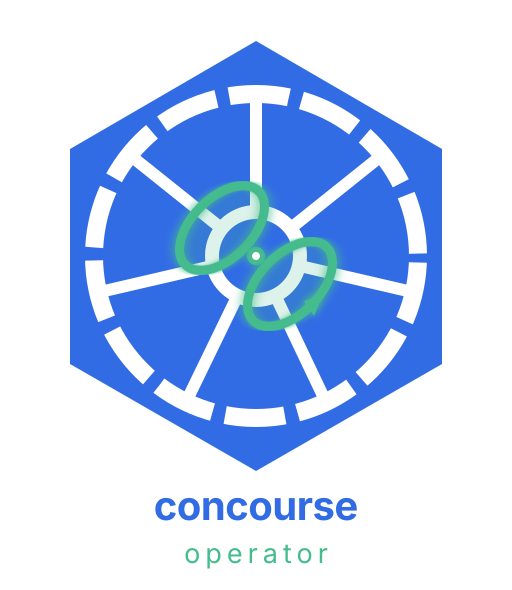
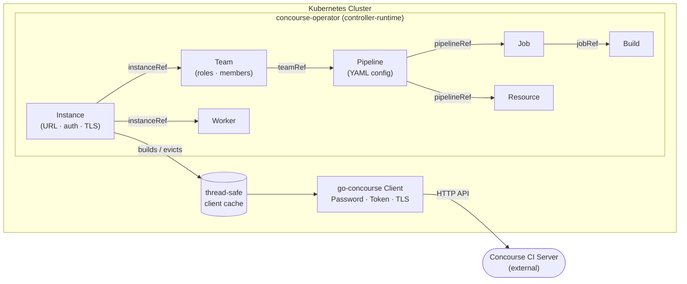
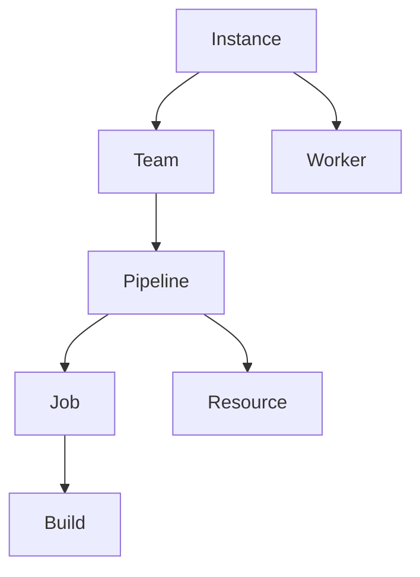

# concourse-operator

<p align="center">
  
</p>

<p align="center">
  <a href="https://jakobmoellerdev.github.io/concourse-operator/"></a>
</p>

A Kubernetes operator that manages [Concourse CI](https://concourse-ci.org) resources declaratively using Custom Resource Definitions (CRDs). Define your Concourse teams, pipelines, jobs, and workers as Kubernetes objects — the operator reconciles them against your Concourse server continuously.

## Description

`concourse-operator` is built with [kubebuilder v4](https://book.kubebuilder.io) and [controller-runtime](https://github.com/kubernetes-sigs/controller-runtime). It communicates with Concourse via the official [go-concourse](https://github.com/concourse/concourse) client library and supports Concourse v8.2.1+.

**API group:** `concourse-ci.org/v1alpha1`

**7 CRDs:**

| Resource | Short names | Purpose |
| --- | --- | --- |
| `Instance` | `cci`, `concinst` | Connection + auth to a Concourse server |
| `Team` | `cct` | Team management with role bindings |
| `Pipeline` | `ccp` | Pipeline configuration (inline or ConfigMap-sourced) |
| `Job` | `ccj` | Job pause/unpause (create a `Build` CR to trigger) |
| `Build` | `ccb` | Build lifecycle tracking, adopt, and cancel |
| `Resource` | `ccr` | Projection of a pipeline resource (pin + check) |
| `Worker` | `ccw` | Worker lifecycle (`Running` / `Draining` / `Removed`) |

## Architecture



### Component Details

**Instance** is the root resource. It holds the Concourse server URL, authentication credentials, TLS configuration, and `allowedNamespaces` for cross-namespace refs. The operator builds an authenticated HTTP client and stores it in a thread-safe cache. Secrets used for auth and TLS are watched — rotating a credential Secret evicts the cached client automatically.

**Team** references an `Instance` and manages a team in Concourse including role bindings (owner, member, pipeline-operator, viewer). `teamName` and `instanceRef` are immutable. Deleting a Team CR deletes the Concourse team unless `reclaimPolicy: Orphan`. Destroying the reserved `main` team also requires `allowDestroy: true`.

**Pipeline** references a `Team` and manages a pipeline configuration (`config.inline` or `config.configMapRef`, exactly one). The operator SHA256-hashes the pipeline YAML to detect config drift and only applies changes when necessary. Pipelines can be paused or exposed via the spec. Deleting a Pipeline CR deletes the Concourse pipeline unless `reclaimPolicy: Orphan`.

**Job** references a `Pipeline` and controls job state (pause/unpause). Create a `Build` CR to trigger a new build. History limits (`successfulBuildsHistoryLimit` / `failedBuildsHistoryLimit`, default 3) prune old Build CRs.

**Build** references a `Job` (`jobRef` is required). Creating a Build with no `buildID` triggers a new Concourse build once; setting `buildID` adopts an existing one. The operator tracks the full build lifecycle: `pending → started → succeeded / failed / errored / aborted`. Set `canceled: true` to abort a running build.

**Resource** is a projection of a named pipeline resource. It does not define the Concourse resource (type/source live in the Pipeline config). Set `pinnedVersion` to pin; clear it to unpin. Optional `checkInterval` triggers operator-driven checks.

**Worker** references an `Instance` and manages worker lifecycle via `spec.lifecycle`: `Running` (default, leave in the pool), `Draining` (land / graceful drain), or `Removed` (prune). `workerName` defaults to `metadata.name`.

### Dependency Chain



Each controller resolves its dependency chain before calling the Concourse API. If a parent resource is not Ready, the child requeues until it is.

## Usage

### 1. Create a credentials Secret

```yaml
apiVersion: v1
kind: Secret
metadata:
  name: concourse-local-credentials
  namespace: default
stringData:
  password: your-concourse-password
```

### 2. Connect to Concourse — Instance

```yaml
apiVersion: concourse-ci.org/v1alpha1
kind: Instance
metadata:
  name: instance-sample
  namespace: default
spec:
  url: http://localhost:8080
  auth:
    password:
      username: test
      passwordRef:
        name: concourse-local-credentials
        key: password
  healthProbeInterval: 5m
```

**Token-based auth** (alternative):

```yaml
spec:
  url: https://ci.example.com
  auth:
    token:
      tokenRef:
        name: concourse-token-secret
        key: token
```

**Custom TLS** (optional). `caRef` and `insecureSkipVerify` are mutually exclusive:

```yaml
spec:
  tls:
    caRef:
      name: concourse-ca-cert
      key: ca.crt
```

Check status after applying:

```sh
kubectl get instance instance-sample \
  -o jsonpath='{.status.conditions}'
```

### 3. Create a Team — Team

```yaml
apiVersion: concourse-ci.org/v1alpha1
kind: Team
metadata:
  name: team-sample
  namespace: default
spec:
  instanceRef:
    name: instance-sample
  teamName: main
  allowDestroy: false
  reclaimPolicy: Delete
  roles:
    - role: owner
      users:
        - local:test
```

### 4. Deploy a Pipeline — Pipeline

**Inline config:**

```yaml
apiVersion: concourse-ci.org/v1alpha1
kind: Pipeline
metadata:
  name: pipeline-sample
  namespace: default
spec:
  teamRef:
    name: team-sample
  pipelineName: hello-world
  paused: false
  exposed: false
  reclaimPolicy: Delete
  config:
    inline: |
      jobs:
        - name: hello
          plan:
            - task: say-hello
              config:
                platform: linux
                image_resource:
                  type: registry-image
                  source: { repository: alpine }
                run:
                  path: echo
                  args: ["Hello, world!"]
```

**ConfigMap-sourced config** (for larger pipelines; exactly one of `inline` or `configMapRef`):

```yaml
spec:
  teamRef:
    name: team-sample
  pipelineName: my-pipeline
  config:
    configMapRef:
      name: my-pipeline-config
      key: pipeline.yaml
```

The operator detects config changes via SHA256 hash — updating the ConfigMap triggers a reconcile.

**Pipeline variables** (exactly one of `value` or `valueFrom` per var):

```yaml
spec:
  vars:
    - name: git-branch
      value: main
    - name: deploy-key
      valueFrom:
        name: deploy-secrets
        key: ssh-private-key
```

### 5. Manage Jobs — Job

```yaml
apiVersion: concourse-ci.org/v1alpha1
kind: Job
metadata:
  name: job-sample
  namespace: default
spec:
  pipelineRef:
    name: pipeline-sample
  jobName: hello
  paused: false
```

To trigger a build, create a `Build` CR (there is no `triggerBuild` field on Job).

### 6. Track Builds — Build

```yaml
apiVersion: concourse-ci.org/v1alpha1
kind: Build
metadata:
  name: build-sample
  namespace: default
spec:
  jobRef:
    name: job-sample
  canceled: false   # set true to abort a running build
```

Check build status:

```sh
kubectl get build build-sample \
  -o jsonpath='{.status.concourseStatus}'
```

### 7. Pin Resource Versions — Resource

```yaml
apiVersion: concourse-ci.org/v1alpha1
kind: Resource
metadata:
  name: resource-sample
  namespace: default
spec:
  pipelineRef:
    name: pipeline-sample
  resourceName: my-repo
  checkInterval: 5m
```

To pin, set `spec.pinnedVersion` to the version map (for example `{ref: abc123}`).

### 8. Manage Workers — Worker

```yaml
apiVersion: concourse-ci.org/v1alpha1
kind: Worker
metadata:
  name: worker-sample
  namespace: default
spec:
  instanceRef:
    name: instance-sample
  workerName: worker-1
  lifecycle: Running   # Running | Draining | Removed
```

### Apply all samples at once

```sh
kubectl apply -k config/samples/
```

## Getting Started

### Prerequisites

- go version v1.24.6+
- docker version 17.03+.
- kubectl version v1.11.3+.
- Access to a Kubernetes v1.11.3+ cluster.
- Access to a running Concourse CI instance (v8.2.1+).

### To Deploy on the cluster

**Build and push your image to the location specified by `IMG`:**

```sh
make docker-build docker-push IMG=<some-registry>/concourse-operator:tag
```

**NOTE:** This image ought to be published in the personal registry you specified.
And it is required to have access to pull the image from the working environment.
Make sure you have the proper permission to the registry if the above commands don't work.

**Install the CRDs into the cluster:**

```sh
make install
```

**Deploy the Manager to the cluster with the image specified by `IMG`:**

```sh
make deploy IMG=<some-registry>/concourse-operator:tag
```

> **NOTE**: If you encounter RBAC errors, you may need to grant yourself cluster-admin
privileges or be logged in as admin.

**Create instances of your solution**
You can apply the samples (examples) from the config/sample:

```sh
kubectl apply -k config/samples/
```

>**NOTE**: Ensure that the samples has default values to test it out.

### To Uninstall

**Delete the instances (CRs) from the cluster:**

```sh
kubectl delete -k config/samples/
```

**Delete the APIs(CRDs) from the cluster:**

```sh
make uninstall
```

**UnDeploy the controller from the cluster:**

```sh
make undeploy
```

## Project Distribution

Following the options to release and provide this solution to the users.

### By providing a bundle with all YAML files

1. Build the installer for the image built and published in the registry:

```sh
make build-installer IMG=<some-registry>/concourse-operator:tag
```

**NOTE:** The makefile target mentioned above generates an 'install.yaml'
file in the dist directory. This file contains all the resources built
with Kustomize, which are necessary to install this project without its
dependencies.

1. Using the installer

Users can just run 'kubectl apply -f <URL for YAML BUNDLE>' to install
the project, i.e.:

```sh
kubectl apply -f https://raw.githubusercontent.com/<org>/concourse-operator/<tag or branch>/dist/install.yaml
```

### By providing a Helm Chart

1. Build the chart using the optional helm plugin

```sh
kubebuilder edit --plugins=helm/v2-alpha
```

1. See that a chart was generated under 'dist/chart', and users
can obtain this solution from there.

**NOTE:** If you change the project, you need to update the Helm Chart
using the same command above to sync the latest changes. Furthermore,
if you create webhooks, you need to use the above command with
the '--force' flag and manually ensure that any custom configuration
previously added to 'dist/chart/values.yaml' or 'dist/chart/manager/manager.yaml'
is manually re-applied afterwards.

## Contributing

See [CONTRIBUTING.md](CONTRIBUTING.md).

**NOTE:** Run `make help` for more information on all potential `make` targets

More information can be found via the [Kubebuilder Documentation](https://book.kubebuilder.io/introduction.html)

## License

Copyright 2026.

Licensed under the Apache License, Version 2.0 (the "License");
you may not use this file except in compliance with the License.
You may obtain a copy of the License at

    http://www.apache.org/licenses/LICENSE-2.0

Unless required by applicable law or agreed to in writing, software
distributed under the License is distributed on an "AS IS" BASIS,
WITHOUT WARRANTIES OR CONDITIONS OF ANY KIND, either express or implied.
See the License for the specific language governing permissions and
limitations under the License.
