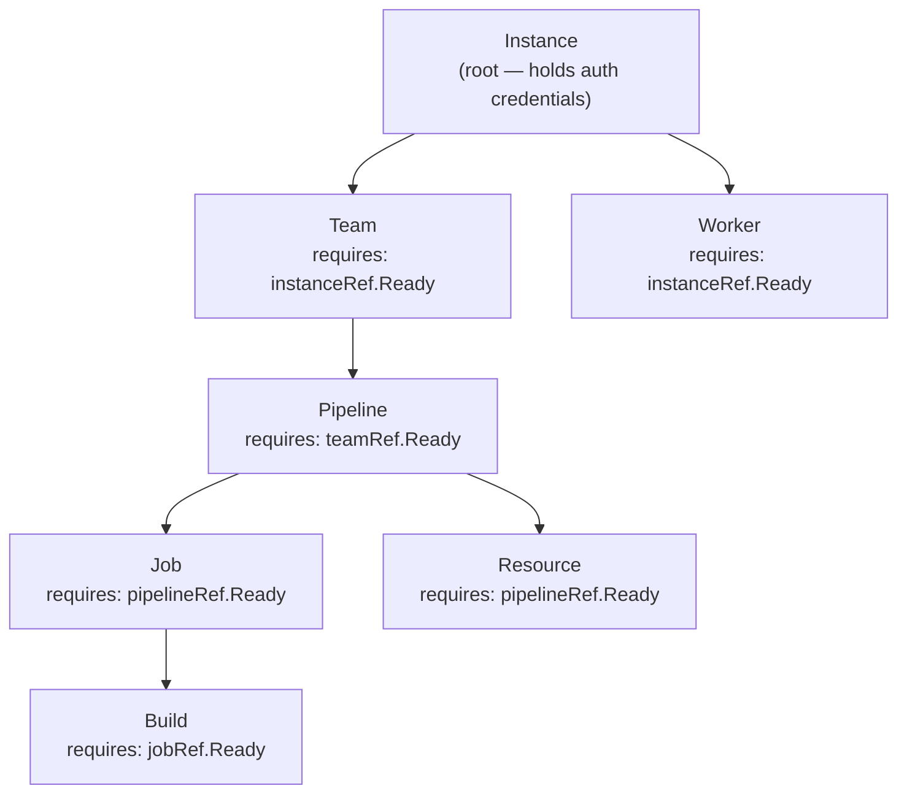

# Dependency Chain

Every resource type except `Instance` depends on a parent resource being `Ready` before it can reconcile. This mirrors the natural hierarchy of Concourse itself.

## Full chain



## How resolution works

Each controller calls a resolver function (defined in `internal/controller/resolver.go`) that walks up the chain:

| Resolver | Walk path |
|----------|-----------|
| `resolveClientForTeam` | Team → Instance |
| `resolveClientForPipeline` | Pipeline → Team → Instance |
| `resolveClientForJob` | Job → Pipeline → Team → Instance |
| `resolveClientForBuild` | Build → Job → Pipeline → Team → Instance |
| `resolveClientForResource` | Resource → Pipeline → Team → Instance |
| `resolveClientForWorker` | Worker → Instance |

If any ancestor is missing or not `Ready`, the resolver returns an error and the child controller requeues with an exponential backoff.

## Cross-namespace references

All `*Ref` fields use `LocalObjectReference` — they reference resources **in the same namespace**. Cross-namespace references are not supported.

## Requeue behavior

When a parent is not `Ready`:

```
Result: {Requeue: true, RequeueAfter: 30s}
```

The child's status condition is set to:

```yaml
- type: Ready
  status: "False"
  reason: DependencyNotReady
  message: "parent resource <name> is not ready"
```
