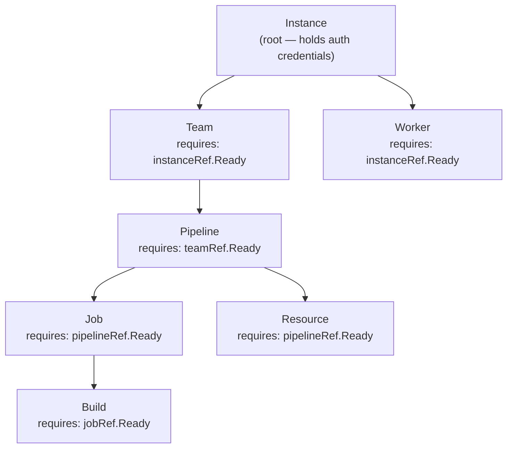

# Dependency Chain

Every resource type except `Instance` depends on a parent resource being `Ready` before it can reconcile. This mirrors the natural hierarchy of Concourse itself.

## Full chain



## How resolution works

Each controller calls a resolver function (defined in `internal/controller/resolver.go`) that walks up the chain:

| Resolver | Walk path |
| ---------- | ----------- |
| `resolveInstanceForTeam` | Team → Instance |
| `resolveClientForPipeline` | Pipeline → Team → Instance |
| `resolveClientForJob` | Job → Pipeline → Team → Instance |
| `resolveClientForBuild` | Build → Job → Pipeline → Team → Instance |
| `resolveClientForResource` | Resource → Pipeline → Team → Instance |
| `resolveClientForWorker` | Worker → Instance |

If any ancestor is missing or not `Ready`, the resolver returns an error and the child controller requeues with an exponential backoff.

## Cross-namespace references

All `*Ref` fields use `LocalObjectReference` (`name` + optional `namespace`). When `namespace` is empty, the referent is resolved in the referring object's namespace.

Cross-namespace refs are allowed only if `Instance.spec.allowedNamespaces` includes the child's namespace, or contains `"*"`. Empty `allowedNamespaces` means only the Instance's own namespace may reference it.

```yaml
apiVersion: concourse-ci.org/v1alpha1
kind: Instance
metadata:
  name: shared
  namespace: concourse
spec:
  url: https://ci.example.com
  auth:
    token:
      tokenRef:
        name: concourse-token
        key: token
  allowedNamespaces:
    - app-team
    - "*"   # or use * to allow every namespace
```

```yaml
apiVersion: concourse-ci.org/v1alpha1
kind: Team
metadata:
  name: app
  namespace: app-team
spec:
  instanceRef:
    name: shared
    namespace: concourse
  teamName: app
```

Auth and TLS Secrets stay in the Instance's namespace (`SecretKeySelector` has no namespace field).

## Requeue behavior

When a parent is not `Ready`:

```
Result: {Requeue: true, RequeueAfter: 30s}
```

The child's status condition is set to:

```yaml
- type: Ready
  status: "False"
  reason: DependencyNotReady
  message: "parent resource <name> is not ready"
```
