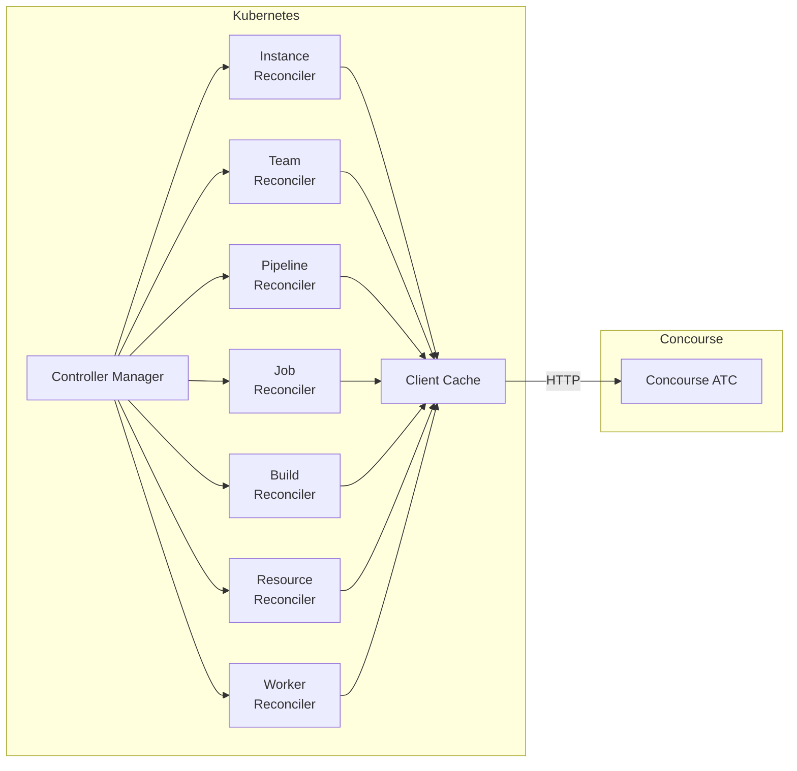
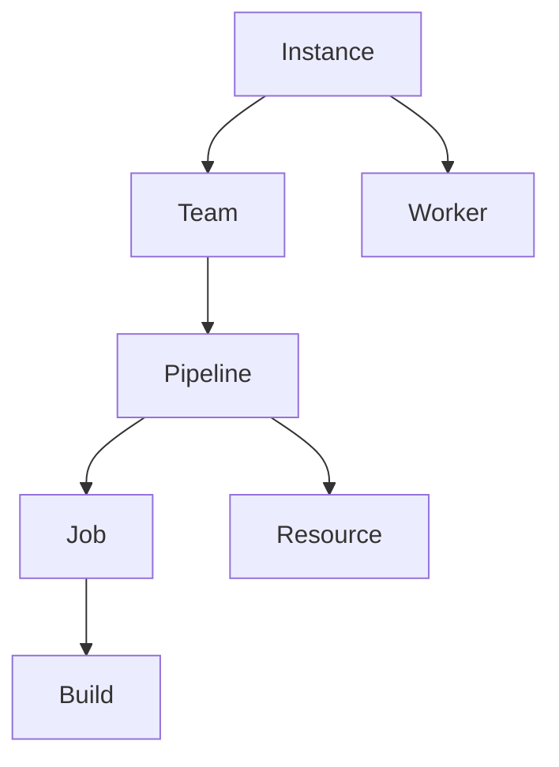

# Architecture

## Overview

concourse-operator is built with [kubebuilder v4](https://book.kubebuilder.io/) on top of [controller-runtime](https://github.com/kubernetes-sigs/controller-runtime). A single manager binary runs seven reconcilers — one per CRD — and communicates with Concourse via the [go-concourse](https://github.com/concourse/go-concourse) client library.

## Resource hierarchy

Each resource type lives within a parent context. Controllers walk the dependency chain to obtain an authenticated Concourse client before calling the API.

Details: [Dependency Chain](dependency-chain.md)

## Components

### Controller Manager (`cmd/main.go`)

The entry point. Registers all seven reconcilers, configures leader election, starts the metrics server, and runs the controller-runtime manager loop.

### CRD controllers (`internal/controller/`)

One reconciler per resource kind. Each reconciler:

1. Fetches the target CR
2. Resolves the dependency chain to obtain an authenticated `concourse.Client`
3. Calls the Concourse API to reconcile desired → actual state
4. Updates `status.conditions` to reflect the result
5. Requeues if the parent is not yet `Ready`

### Client cache (`internal/concourse/client_cache.go`)

A thread-safe cache of `concourse.Client` instances. See [Client Cache](client-cache.md).

### Auth helpers (`internal/concourse/auth.go`)

Builds `http.Client` values with an OAuth2 password grant (`spec.auth.password`), bearer token auth (`spec.auth.token`), and optional custom CA / `insecureSkipVerify`. Reads credentials from Kubernetes `Secret` objects. Auth Secrets are watched so rotation does not require annotating the Instance.

## Status conditions

All seven resource types expose a `conditions` array following the standard `metav1.Condition` schema:

| Condition type | Meaning |
| ---------------- | --------- |
| `Ready` | Reconciliation succeeded; resource is in sync with Concourse |
| `Authenticated` | (Instance) Connection and credentials verified |
| `WorkersHealthy` | (Instance) No workers in the stalled state |
| `ConfigSynced` / `ConfigWarning` | (Pipeline / Team) Last config apply result |
| `LastBuildSucceeded` | (Job) Most recent finished build succeeded |
| `CheckHealthy` | (Resource) Last resource check succeeded |
| `Complete` | (Build) Build reached a terminal state |
| `Stalled` / `StateTransitioning` | (Worker) Observed / desired lifecycle |

Conditions use `observedGeneration` to distinguish stale observations from current ones.
