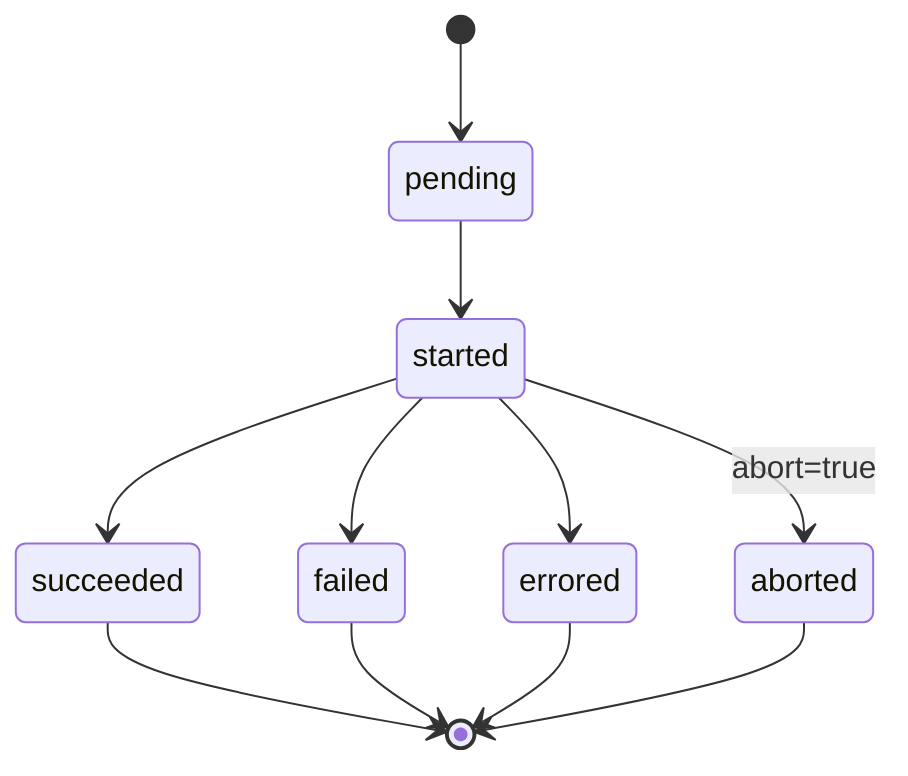

# ConcourseBuild

Tracks and controls a Concourse build. Can be tied to a job or be a standalone one-off build.

## Examples

=== "Job-triggered build"

    ```yaml
    apiVersion: concourse.concourse-ci.org/v1alpha1
    kind: ConcourseBuild
    metadata:
      name: my-build
    spec:
      jobRef:
        name: my-job
      abort: false
    ```

=== "One-off build"

    ```yaml
    apiVersion: concourse.concourse-ci.org/v1alpha1
    kind: ConcourseBuild
    metadata:
      name: my-oneoff
    spec:
      oneOff: true
      abort: false
    ```

## Spec

| Field | Type | Required | Default | Description |
|-------|------|----------|---------|-------------|
| `jobRef` | [LocalObjectReference](index.md#localobjectreference) | no | — | The job that owns this build. Required unless `oneOff: true`. |
| `oneOff` | boolean | no | `false` | If `true`, this is a standalone build not associated with a pipeline job. Mutually exclusive with `jobRef`. |
| `abort` | boolean | no | `false` | If `true` and the build is running, the operator will abort it. |

## Status

| Field | Type | Description |
|-------|------|-------------|
| `conditions` | []metav1.Condition | `Ready` condition. |
| `buildID` | integer | Numeric Concourse build ID. |
| `buildName` | string | Display name (e.g. `"42"`). |
| `concourseStatus` | [BuildStatus](#buildstatus) | Current build status as reported by Concourse. |
| `startTime` | metav1.Time | When the build started. |
| `endTime` | metav1.Time | When the build completed (all terminal states). |
| `apiURL` | string | Direct URL to the build in the Concourse web UI. |
| `observedGeneration` | int64 | Generation of the spec that produced the current status. |

### BuildStatus

| Value | Meaning |
|-------|---------|
| `pending` | Build is queued, not yet started. |
| `started` | Build is actively running. |
| `succeeded` | Build completed successfully. |
| `failed` | Build completed with a failure. |
| `errored` | Build failed due to a system error (not task failure). |
| `aborted` | Build was manually aborted. |



## Usage notes

- Exactly one of `jobRef` or `oneOff: true` must be set.
- `abort: true` only has effect when `concourseStatus` is `started`. The operator sets it to `False` after the abort is confirmed.
- `ConcourseBuild` CRs are typically created automatically by `ConcourseJob` when `triggerBuild: true` is set, but you can also create them manually.
