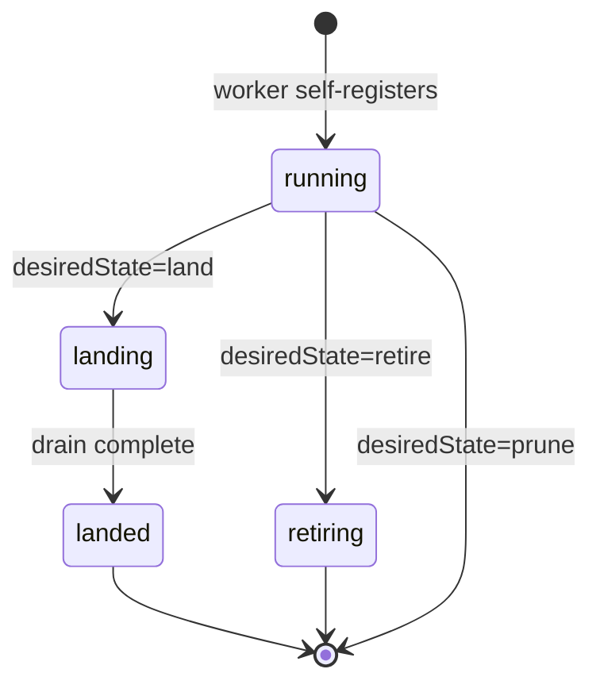

# Worker

Manages the lifecycle of a Concourse worker: land, retire, or prune it from the pool.

## Example

```yaml
apiVersion: concourse-ci.org/v1alpha1
kind: Worker
metadata:
  name: my-worker
spec:
  instanceRef:
    name: my-concourse
  workerName: worker-1
  desiredState: active
```

## Spec

| Field | Type | Required | Default | Description |
|-------|------|----------|---------|-------------|
| `instanceRef` | [LocalObjectReference](index.md#localobjectreference) | yes | — | The `Instance` this worker belongs to. |
| `workerName` | string | yes | — | Unique name of the worker as registered in Concourse. |
| `desiredState` | [WorkerDesiredState](#workerdesiredstate) | no | `active` | Desired lifecycle state. |

### WorkerDesiredState

| Value | Effect |
|-------|--------|
| `active` | No-op. Workers self-register; the operator only observes status. |
| `land` | Gracefully drain the worker: finish running tasks, then mark it as `landed`. |
| `retire` | Mark the worker as retired and remove it from the active pool. |
| `prune` | Forcibly remove the worker from Concourse immediately, regardless of running tasks. |



## Status

| Field | Type | Description |
|-------|------|-------------|
| `conditions` | []metav1.Condition | `Ready` condition. |
| `actualState` | string | Current worker state as reported by Concourse (`running`, `landing`, `landed`, `retiring`, `stalled`). |
| `platform` | string | Worker OS platform (e.g. `linux`, `darwin`). |
| `tags` | []string | Tags the worker registered with. |
| `activeContainers` | integer | Number of containers currently running on this worker. |
| `activeVolumes` | integer | Number of volumes currently mounted on this worker. |
| `observedGeneration` | int64 | Generation of the spec that produced the current status. |

## Usage notes

- Workers **self-register** with Concourse; the operator cannot create or start a worker. The CR only controls lifecycle transitions (land, retire, prune).
- `desiredState: active` is a no-op — the operator observes and reports the worker's current state but does not call any Concourse API.
- Use `prune` only when the worker is unresponsive or has been physically removed. Pruning a healthy worker with running tasks will terminate them immediately.
- `workerName` must exactly match the name the worker registered with (visible in `fly workers`).
